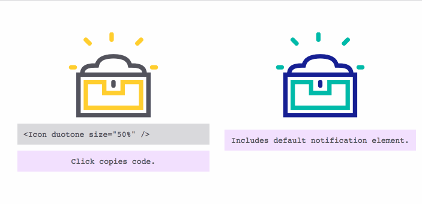

# react-click-copy-code

> Copies any child component's code to clipboard. Great for example pages.

[](https://www.npmjs.com/package/react-click-copy-code) [](https://standardjs.com)

[](https://hydrateio.github.io/react-click-copy-code/)
[View example ↪](https://hydrateio.github.io/react-click-copy-code/)

## Install

```bash
yarn add react-click-copy-code
```

## Usage

```jsx
import React, { Component } from 'react'

import { ClickCopy } from 'react-click-copy-code'

class Example extends Component {
  render () {
    return (
      <ClickCopy>
      {/* Put anything you want in here. Including subcomponents. */}
        <ClickCopy.Items>
        {/* Components to copy go inside here. */}
         <Icon size={'50%'} duotone={true} />
        </ClickCopy.Items>
        {/* Optional Source and Notification friends */}
        <ClickCopy.Source />
        <ClickCopy.Notification />
      </ClickCopy>
    )
  }
}
```

## Properties

### ClickCopy
| Property | Type | Default |  Description |
| -------- | ----------- | ---- | ------- |
| copyText | string | 'Click to copy!' | Text shown in notification when ready to copy. |
| formattingOptions | object | { showDefaultProps: false } | Any option from [react-element-to-jsx-string options](https://github.com/algolia/react-element-to-jsx-string)
| errorText | string | 'Oops. Try again.' | Text shown in notification when copy action fails. |
| onClick | function | Copies text and sets state to success/fail. | Function called when element is clicked. Custom will be called alongside default. |
| onError | function | Resets state to ready to copy. | Function called when copy action fails. Custom will be called alongside default. |
| onSuccess | function | Resets state to ready to copy. | Function called when when copy action succeeds. Custom will be called alongside default. |
| sourceOverwrite | string | ----------- | Optional text to be copied to the clipboard in place of the source contained in the Items subcomponent. |
| successText | string | 'Copied!' | Text shown in notification when copy action succeeds. |

### ClickCopy.Items
This space intentionally left blank — no props for the `Items`!

### ClickCopy.Notification
| Property | Type | Default | Description |
| -------- | ----------- | ---- | ------- |
| background | string | #001eff  | Set background color of notification overlay. |
| color | string | white  | Set text color of notification overlay. |
| font | string | monospace  | Set font family of notification overlay. |
| className | string | -----------  | Composes with internal classes. |
| style | object | -----------  | Overwrites internal style attributes. |


### ClickCopy.Source
| Property | Type | Default | Description |
| -------- | ----------- | ---- | ------- |
| background | string | #dadadd | Set background color of source box. |
| color | string | #53535c | Set text color of source box. |
| font | string | monospace | Set font family of source box. |
| className | string | ---- | Composes with internal classes. |
| style | object | ---- | Overwrites internal style attributes. |


## License

MIT © [hydrate.io](https://github.com/hydrateio)
